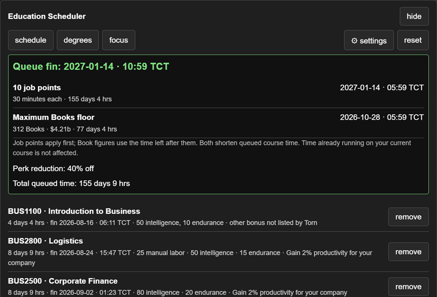
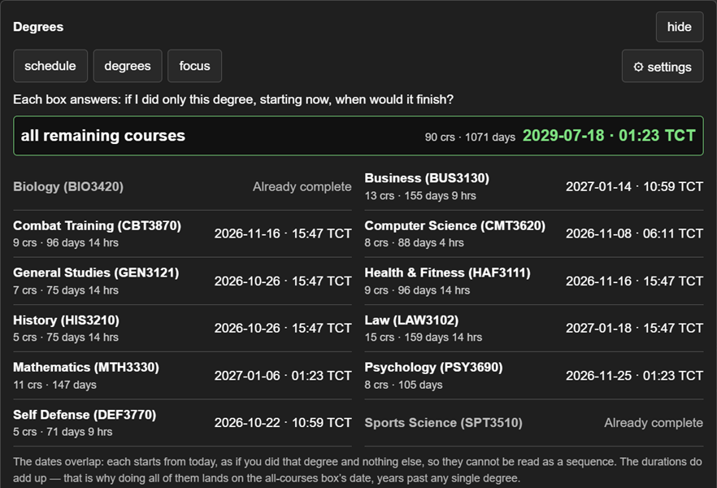
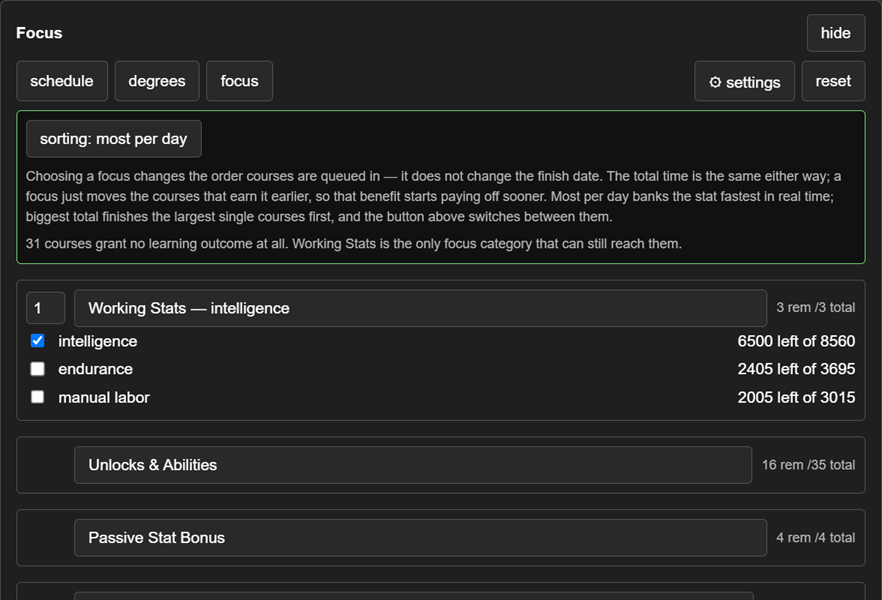
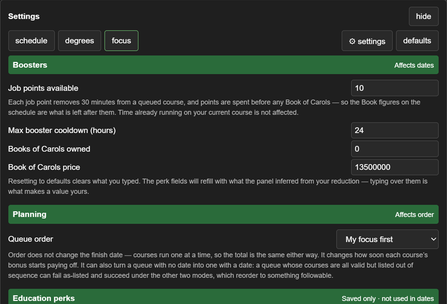

# Torn Education Scheduler

> ## 📱 TORN PDA COMPATIBLE
>
> Runs in the **Torn PDA** app as well as desktop Tampermonkey. The planner
> lays out for narrow mobile screens, and the panel appears reliably under
> PDA's own userscript engine.

A Tampermonkey userscript that turns Torn's education page into a complete,
live education planner. Build a prerequisite-safe course queue, choose which
benefits to earn first, compare degree paths, and see exactly when the plan
will finish using your current course progress and personal education-time
reduction. No API key is required.

New to Torn education? Read the
[practical beginner's guide and script companion](https://www.torn.com/forums.php#p=threads&f=61&t=16589908&b=0&a=0).

## Screenshots

<p align="center">
  
  
  
  
</p>

## Features

### Schedule planner

- Add one course or every remaining course. Adding a course automatically adds
  its unfinished prerequisite chain in a valid order, including the full
  tier-2 requirement for bachelor courses.
- Load one of five numbered beginner-guide presets directly from the course
  picker. Each route appends only unfinished work and prerequisites, includes
  the two-course Start Here foundation where needed, and leaves an existing
  hand-built queue intact. A preset leaves the picker once all of its work is
  completed, active, or already queued.
- See the total queued time, exact finish date and time in Torn City Time, and
  a projected finish for every queued course.
- See each course's working-stat gains and Torn-provided learning outcomes
  directly in its queue row.
- Open **summary** for the whole path at a glance: course and degree counts,
  queued time, finish date, total working stats, and every bonus the queue
  delivers, listed per selection rather than added across different kinds. It
  closes as soon as you use anything else.
- Choose from four prerequisite-safe ordering strategies: **My focus first**,
  **As listed**, **Shortest first**, and **Unlocks first**.
- Reorder the queue by hand using the up and down controls on each row. A move
  that would put a course ahead of something it requires — or leave one behind
  a course that requires it — is disabled rather than rejected after the fact,
  and says which course is blocking it. Moving a course by hand switches the
  ordering strategy to **As listed** and tells you it did.
- Reconcile old saved plans with the live catalogue: courses that have since
  completed, started, or disappeared are removed and reported instead of being
  silently counted.
- Get a visible explanation instead of a misleading date if a saved or edited
  queue cannot currently be followed.

### Goal-based Focus ordering

- Prioritise the outcomes you care about across ten categories, including
  working stats, passive stats, combat and gym bonuses, crime, companies,
  computing, medical effectiveness, progression, and unlocks.
- Set multiple focuses in priority order. The first focus wins; later focuses
  break ties without mixing unlike benefits into a made-up combined score.
- Rank benefits by **most per day** or **biggest total**, while prerequisites
  always remain ahead of the courses they unlock.
- With no focus selected, use a balanced default that brings gain multipliers
  forward, then measurable benefits, then unlock-oriented courses.
- Track how much of each focus is complete and how much remains.

### Degrees and booster projections

- Compare all twelve education categories and the complete remaining catalogue.
  Every estimate starts from your current state and includes unfinished
  prerequisites, course count, duration, and finish date.
- Model job points at 30 minutes of course-time reduction each.
- Model owned Books of Carols at six hours of course-time reduction each,
  constrained by your maximum booster cooldown (48 hours by default).
- See the shortest possible Book of Carols finish date, the number of Books it
  can use, its cost, and the cooldown assumption used for that floor.

### Settings, sharing, and reliability

- Read the education reduction Torn has already applied to your course times;
  where the reduction has a unique explanation, infer and record the likely
  merits, Principal rank, and WSU stock-block perks.
- Save the queue, ordering, focuses, booster assumptions, perk records, and panel
  visibility in Tampermonkey storage.
- Export a compact plan string and import it in another browser. Imports are
  validated against the live course catalogue before anything is saved.
- Generate a deliberately limited debug report for support without including
  the raw Torn response, session token, completed-course history, or active
  course timing.
- Follow Torn's single-page navigation: the panel mounts when you visit
  Education, unmounts when you leave, and falls back to Torn's loaded page data
  if the normal same-origin request fails.
- Use scoped, two-step reset controls for the queue, Focus choices, and settings.

## How calculations work

Torn supplies each course's original duration, your already-reduced duration,
its prerequisites, and the completion time of your active course. The scheduler
starts the queue when that active course finishes and places the remaining
courses back to back. Because it uses Torn's reduced durations directly, it
does not need to reconstruct your education perks or ask for an API key.

Changing the order does **not** change the total finish date: the same courses
still take the same combined time. Ordering changes when each course's benefit
starts paying off. Degree estimates also start from the current state, so they
are alternatives for comparison rather than one combined sequence.

Job points and Books of Carols are planning scenarios for queued courses. They
do not alter Torn or spend any items.

## Install

### Desktop

1. Install [Tampermonkey](https://www.tampermonkey.net/).
2. Install [Torn Education Scheduler from Greasy Fork](https://greasyfork.org/en/scripts/590070-torn-education-scheduler).
3. Visit <https://www.torn.com/page.php?sid=education>.

### Torn PDA (mobile)

1. Add the script through Torn PDA's own userscript manager, using the same
   [Greasy Fork](https://greasyfork.org/en/scripts/590070-torn-education-scheduler)
   listing.
2. Open the Education page in the app.

No separate mobile build exists — the same file runs in both places.

The scheduler appears in a themed, collapsible panel on the Education page.

## Privacy and permissions

- The script runs only on Torn's Education route, despite the broader metadata
  match needed for a query-string page.
- It requests only Tampermonkey's local `GM_getValue` and `GM_setValue`
  permissions.
- It reads Torn's own education data through a same-origin request. It makes no
  third-party requests and has no `@connect` permission.
- Plans and settings stay in Tampermonkey storage. Clearing ordinary Torn site
  data does not clear them; removing the userscript or its storage does.
- The script never enrols in courses, changes your active education, spends job
  points or Books, or otherwise writes to your Torn account.

## Limitations

- Results depend on the education data Torn supplies. If Torn changes its
  catalogue or page internals, the panel may show a named acquisition or data
  error until the script is updated.
- A benefit that Torn does not list is shown as unknown instead of being
  guessed.
- Bachelor-course colour in the native course picker may not appear on macOS,
  where the operating system controls `<select>` option styling.

## Development

```text
npm test           # unit tests, Node only, no browser
npm run test:syntax
npm run verify:forum
```

Tests never modify the userscript on disk; see `tests/load-userscript.js`.
